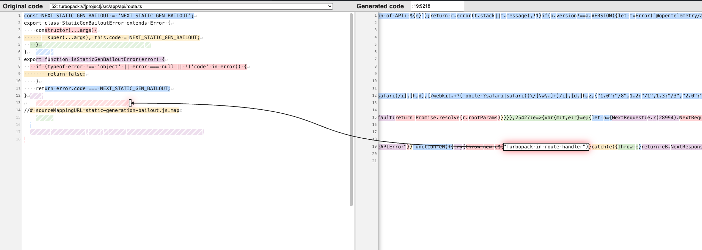

## Turbopack sourcemaps repro

Build the app using `npm run build` and inspect the sourcemaps for `.next/server/app/api/route.js` -> the chunk file where the error from the route handler (`throw new SentryExampleAPIError("Turbopack in route handler");`) is located seems to mapped incorrectly:

